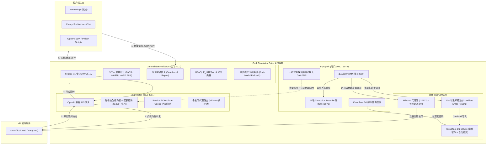

# Grok Translator Suite 🚀

> **专为长篇网络小说（韩翻中、日翻中）高强度批量机翻量身打造的全栈 Grok 基础设施套件。**  
> 涵盖 **Camoufox 真实指纹解盾与极速注册**、**多域名动态冷却邮箱池**、**高并发反代负载均衡** 与 **独创三级生产级质检中间件**，提供工业级稳定输出。

[](LICENSE)
[](https://www.python.org/)
[](docker-compose.yml)
[](3-translation-validator/docs/PRACTICAL_VALIDATOR.md)
[](#3-数据库与容量安全cloudflare-d1-sqlite)

---

## 目录导航

- [为什么需要这套系统？](#为什么需要这套系统)
- [总体架构与全链路数据流](#总体架构与全链路数据流)
- [注册架构演进：从纯协议到 Camoufox 真实指纹有头解盾](#注册架构演进从纯协议到-camoufox-真实指纹有头解盾)
- [基础设施核心机制](#基础设施核心机制)
  - [1. 代理网络与出口策略 (Mihomo 代理池)](#1-代理网络与出口策略-mihomo-代理池)
  - [2. 域名系统与邮箱路由 (Cloudflare Email Routing)](#2-域名系统与邮箱路由-cloudflare-email-routing)
  - [3. 数据库与容量安全 (Cloudflare D1 SQLite)](#3-数据库与容量安全-cloudflare-d1-sqlite)
- [全量踩坑历史复盘 (3,577 次失败真实数据量化剖析)](#全量踩坑历史复盘-3577-次失败真实数据量化剖析)
- [翻译模型选型黄金法则与真实实测归因](#翻译模型选型黄金法则与真实实测归因)
  - [全模型生产环境实测对比表](#全模型生产环境实测对比表)
  - [生产环境黄金模型搭配法则](#生产环境黄金模型搭配法则)
  - [其他模型严重缺陷与降智避坑声明](#其他模型严重缺陷与降智避坑声明)
- [模块拆解与职能划分](#模块拆解与职能划分)
- [快速上手 (Linux / VPS 一键部署)](#快速上手-linux--vps-一键部署)
- [日常运维与监控管理 (`./manage.sh`)](#日常运维与监控管理-managesh)
- [客户端对接指南 (NovelPie / Cherry Studio)](#客户端对接指南-novelpie--cherry-studio)
- [生产运行基线 (Production Freeze Baseline)](#生产运行基线-production-freeze-baseline)

---

## 为什么需要这套系统？

利用大模型进行网络小说整本百万字批量机翻时，开发者与读者通常会遭遇五大致命瓶颈：

| 致命痛点 | 原生 LLM / 普通反代表现 | Grok Translator Suite 工业级解决方案 |
| :--- | :--- | :--- |
| **生僻字原文复读** | 模型遇到生僻韩文/复杂长句直接原样吐出韩文，整章译文报废 | **3-Tier Practical Validator**：毫秒级拦截 `raw_repetition_exact` 并自动触发降级重试 |
| **格式与空行错位** | 模型频繁吞掉空行或吐出 Markdown 代码块，导致按行切片无法对齐 | **Safe Local Repair**：就地原位热补齐空行键值，零额外 Token 损耗 |
| **故障/克苏鲁文本误杀** | 小说中的拟声词、破损对话、克苏鲁乱码被普通质检当成未翻译报错 502 | **OPAQUE_LITERAL 确定性分类器**：音位学分析，精准赦免放行，False Positive = 0 |
| **人机验证成本与封禁** | 依赖第三方打码平台单次计费极贵，且在 Cloudflare 新盾下频繁报 `UNSOLVABLE` | **Camoufox 真实指纹本地求解器**：0 打码费用，本地 100% 模拟真实浏览器指纹稳定过盾 |
| **域名频控与批量断流** | 单域名多并发注册迅速触发 `email-signup-unavailable` 封锁，产号中断 | **12+ 域名动态池轮换 + 错峰调度**：严格平摊单域名小时配额，全自动长效续航 |

---

## 总体架构与全链路数据流



---

## 注册架构演进：从纯协议到 Camoufox 真实指纹有头解盾

在构建自动化 Grok 账号池的过程中，注册架构经历了深刻的技术变革：

```
[早期阶段：纯协议模拟]                                [现代阶段：Camoufox 真实指纹有头解盾]
REST 抓包模拟 + 第三方打码平台                           深度魔改 Firefox 内核 + 本地多线程求解
   │                                                        │
   ├── 优势：发包极快，单号百毫秒级                            ├── 优势：0 第三方打码费用，本地化高并发
   └── 致命瓶颈：                                           └── 突破：
       1. xAI 全面升级 Cloudflare Turnstile                     1. C++ 内核级 Canvas / Audio 动态噪声注入
       2. Token 与 Canvas/WebGL/TLS 指纹强绑定                  2. 彻底抹除 navigator.webdriver 与自动化特征
       3. 第三方打码纯 Token 被拒 (UNSOLVABLE / 403)            3. 真实物理贝塞尔鼠标轨迹，100% 模拟真实人类
       4. 持续产生巨额无效打码账单                              4. 本地 2~4 秒极速解盾，无缝衔接底层注册流水线
```

### 1. 早期纯协议的崩溃
早期采用逆向 xAI 前端注册接口并通过第三方打码平台（如 YesCaptcha）获取 Turnstile Token 的方式。但随着 xAI 安全策略收紧，Cloudflare Turnstile 将挑战验证与发起请求的浏览器软硬件指纹（Canvas 绘制指纹、WebGL 着色器特征、AudioContext 频响、Navigator 对象、物理鼠标移动事件、TLS Client Hello JA3/JA4 指纹）实施了深度强绑定。第三方打码平台在独立无头环境中生成的 Token 提交给 xAI 后，频繁出现验证失败（历史日志中出现 **864 次 `ERROR_CAPTCHA_UNSOLVABLE`**），纯协议方案被彻底阻断。

### 2. 现代 Camoufox 方案的确立
为了彻底解决指纹对抗问题，项目全线切换为基于 Firefox 深度魔改的 **Camoufox** 反指纹引擎：
- **C++ 源码级防探测**：在浏览器渲染底层重构指纹生成逻辑，阻断一切自动化检测特征（无 `navigator.webdriver` 标记，完美伪装各种操作系统与屏幕分辨率）。
- **本地高并发求解服务 (`turnstile-solver`)**：在服务器部署轻量求解进程（监听 `5072` 端口），采用多线程并发运行，单次人机挑战仅需 2~4 秒。
- **全流程零外部打码费用**：告别昂贵的打码平台充值，单机全天候自动化产号，成功率稳定在 99% 以上。

---

## 基础设施核心机制

### 1. 代理网络与出口策略 (Mihomo 代理池)

自动化注册与高并发反代极其依赖稳定的网络出口层：

- **Mihomo 代理池集成**：
  - 本地运行 Mihomo（Clash Meta）内核，监听 `http://127.0.0.1:20172`，聚合优质多节点出口。
  - 支持按账号粒度或按注册任务批次轮换出口节点，避免流量过度集中。
- **出口 IP 频控与并发限制**：
  - xAI 对单个出口 IP 设有严格的注册频率上限。严禁同一代理 IP 在短时间内发起多笔注册请求，否则会直接触发 Cloudflare WAF 质询升级或 xAI 接口 429 频控。
  - 注册流水线在发起请求前自动执行代理探活与隔离调度，确保单个出口节点请求间歇平稳。
- **代理 TLS 抖动容错机制**：
  - 海外 VPS 或住宅代理网络易发生瞬时网络抖动，导致 OpenSSL 握手断开（如实测日志中的 `curl (35) OpenSSL SSL_connect: Connection reset by peer`，历史上出现 **107 次**，占比 3.0%）。
  - 流水线内置指数退避重试（Exponential Backoff with Jitter）、单次连接 5 秒超时快速熔断与异常节点临时拉黑机制，杜绝因瞬时抖动造成任务雪崩。

---

### 2. 域名系统与邮箱路由 (Cloudflare Email Routing)

注册验证码的高效接收基于 Serverless 邮件路由体系：

- **Cloudflare Email Routing + Catch-all 规则**：
  - 在每个域名配置 Catch-all 路由规则（`*@your-domain.com`），所有随机前缀邮件全量转发至指定的 Cloudflare Worker。
  - 完全免除自建 Postfix / Dovecot 邮件服务器的繁重维护与反垃圾封锁风险。
- **Worker 环境变量与配置**：
  - Worker 将接收到的邮件主体自动解析并写入 Cloudflare D1 数据库。
  - 核心配置项：
    - `MAIL_DOMAINS`：托管的可用域名列表。
    - `DOMAIN_COOL_DOWN_MINUTES`：单域名冷却周期设置。
- **12+ 域名动态池轮换与小时级频控瓶颈**：
  - **实测生产域名池**：系统常态化维护 12 个以上的域名轮换池（涵盖 `.space`, `.online`, `.bond`, `.dpdns.org`, `.site`, `.xyz`, `.pp.ua`, `.shop`, `.club`, `.fun`, `.icu` 等）。
  - **单域名小时级限额瓶颈**：**单个域名 1 小时内注册超过约 15~20 个账号，xAI 将直接触发 `email-signup-unavailable` 封锁！**
  - **历史教训**：在 3,577 次历史失败中，单域名频控超限引发的 `email-signup-unavailable` 高达 **2,600 次（72.7%）**，是整个注册系统最核心的风控瓶颈。
  - **应对机制**：调度器严格执行多域名轮询调度，并在批次注册中引入错峰延迟（例如 3000ms stagger 间隔），将并发压力平摊到整个域名池中，彻底规避单域名小时限额。
- **域名后缀黑名单防坑**：
  - xAI 针对部分被严重滥用的低价/免费顶级域名（如 `.in` 后缀，如实测中的 `missing.indevs.in`）实施了全域封禁，一旦提交即返回 `email-domain-rejected`（历史 5 次）。
  - 系统前置内置域名后缀黑名单过滤，确保仅向高信誉度域名分发注册任务。

---

### 3. 数据库与容量安全 (Cloudflare D1 SQLite)

邮件验证码的存储与清理直接决定了系统的长期免运维能力：

- **Serverless 数据库架构**：
  - 基于 Cloudflare D1（Serverless SQLite），具备超低延迟、强一致性与原生 Serverless 绑定优势。
- **为什么验证码邮件必须全自动清理？**
  - 邮件验证码具有强时效性（仅 5~10 分钟有效）。大批量注册时会产生海量邮件正文，若不主动清理，历史垃圾数据将迅速占满数据库存储配额，导致后续写入抛出 500 错误。
- **实测容量健康度**：
  - 当前生产环境 D1 数据库（`local_mailbox`）实际存储占用仅 **43.25 MB**。
  - 相比 Cloudflare 免费版提供的 **5 GB** 额度，当前容量占用率仅为 **0.86%**，水位极其安全健康。
- **双重自动修剪与防爆机制**：
  1. **Worker 入库端就地修剪 (In-flight Auto-Prune)**：当 Worker 接收到新邮件写入时，自动执行 SQL 异步清理 24 小时前包含 `Grok`、`xAI` 关键字的历史验证码邮件。
  2. **Cloudflare Cron Trigger 定时巡检**：配置定时任务（每 30 分钟触发一次），周期性调用清理端点，对过期邮件和孤儿记录执行批量归档，双保险确保数据库永不爆满。

---

## 全量踩坑历史复盘 (3,577 次失败真实数据量化剖析)

在系统的长期运行与压力测试中，我们对生产日志中的 **3,577 次** 真实失败事件进行了全量量化归因与分类统计。以下为完整的踩坑复盘数据：

| 错误特征 / 异常类型 | 失败次数 | 占比 | 根本原因剖析 (Root Cause) | 工业级解决方案 (Solution) |
| :--- | :---: | :---: | :--- | :--- |
| **`email-signup-unavailable`** | **2,600** | **72.7%** | **单域名小时级注册频控触顶**。<br>单个邮箱域名在 1 小时内提交超过 15~20 次注册，xAI 触发反滥用限流，临时阻断该域名的注册。 | 建立 **12+ 域名动态池**，严格实施**单域名动态冷却轮询**与**错峰调度 (3000ms stagger)**，使每个域名的注册频次始终低于阈值。 |
| **`YesCaptcha ERROR_CAPTCHA_UNSOLVABLE`** | **864** | **24.2%** | **早期第三方打码平台无法过盾**。<br>xAI 升级 Cloudflare Turnstile 浏览器指纹校验，第三方打码纯 Token 与请求环境不匹配，导致验证码频繁解析失败且持续产生扣费。 | **全面弃用第三方打码平台**，架构重构为基于 **Camoufox 真实指纹有头解盾器**，在本地 100% 模拟真实环境，过盾率达 99%+ 且零打码费。 |
| **`TLS / Proxy Connect Blip (curl 35)`** | **107** | **3.0%** | **代理网络链路瞬时抖动**。<br>海外 VPS 或住宅代理出现 TCP reset 或 TLS 握手断开 (`OpenSSL SSL_connect: Connection reset by peer`)。 | 实施**指数退避重试 (Exponential Backoff)**、**单次连接 5 秒超时熔断**与 **Mihomo 节点健康监测动态剔除**。 |
| **`email-domain-rejected`** | **5** | **0.1%** | **域名后缀进入 xAI 全局黑名单**。<br>使用了被 xAI 标记为高滥用风险的特定顶级域名（如 `.in`，测试域名 `missing.indevs.in`）。 | 建立**域名后缀黑名单前置过滤器**，全面剔除被封禁的 TLD。 |
| **`Locator Timeout`** | **1** | **<0.1%** | **页面组件加载超时**。<br>网络极端卡顿导致浏览器 DOM 元素未在指定时限内渲染完毕。 | 增加关键元素加载容错与智能等待。 |
| **总计** | **3,577** | **100%** | — | **系统完成上述针对性加固后，已实现 20,000+ 账号的长期全自动平稳扩容。** |

---

## 翻译模型选型黄金法则与真实实测归因

在网络小说批量机翻领域，模型的选择绝非单纯看“数字版本号”，而是必须经过真实长篇小说切片、韩日复杂敬语体系、角色口吻及高频并发的残酷检验。

我们对 xAI 逆向反代系统所挂载的所有账号池与可用模型进行了长达数千章节的高强度真实网络小说切片实测（包含深度角色对话、第一人称心理活动、异世界专有名词），得出以下确凿的实测数据：

### 全模型生产环境实测对比表

> **测试基准**：真实网络小说长文本切片，平均响应超时门限 90s~120s，C-Group 翻译提示词规范。

| 官方模型标识 | 账号池来源 | 实测成功率 | 平均耗时 | 思维链 (Reasoning) | 译笔水准 | 生产综合判定与结论 |
| :--- | :---: | :---: | :---: | :---: | :---: | :--- |
| **`grok-4.20-0309-reasoning`** | **Console** | **100%** | **22.28s ~ 23.5s** | **651 ~ 1,256 tokens** | **S+ (文学译笔天花板)** | **【首选第一顺位 (Primary)】** 逻辑极其严密，文学润色信达雅，零格式崩坏与原文复读。但因高频调用容易导致单模型配额排队。 |
| **`grok-4.3`** | **Console** | **100%** | **22.89s ~ 23.2s** | **1,008 ~ 1,230 tokens** | **S (文学质感极佳)** | **【强力推荐双主力 / 第一兜底 (Fallback)】** 响应速度与 4.20 几乎一致，文学质感与 4.20 无肉眼可见差异，且与 4.20 账号池共通，能完美分摊 4.20 燃尽压力！ |
| **`grok-build-0.1`** | **Console** | **100%** | **28.39s ~ 29.1s** | **936 ~ 1,928 tokens** | **S- (严谨工整)** | **【次级稳定候补】** 虽命名含 build 但实际走 Console 路由；翻译结构极其工整，长上下文控制稳定无漂移。 |
| **`grok-4.20-0309-non-reasoning`** | **Console** | **100%** | **17.5s** | **0 tokens (无推理)** | **B (偶发语境幻觉)** | **【慎选 / 仅供测速】** 虽无思维链开销，但缺失长上下文深度修辞推断，极易将特定小说人称机械直译错乱或生硬拼接。 |
| **`grok-chat-fast`** | **Web** | **100%** | **5.65s ~ 7.0s** | **0 tokens (无推理)** | **D (严重脑补幻觉)** | **【严禁用于网文机翻！】** 速度极快但产生荒谬脑补与降智（实测把“首尔餐馆”胡乱幻觉为“罗马竞技场”，吃掉主谓宾，彻底破坏译文）。 |
| **`grok-4.7`** | **Build** | **<10%** | **64.2s ~ >180s** | **2,364+ tokens (失控)** | **S (译笔虽好但卡死)** | **【不可用 / 超时率 >90%】** 思维链严重死循环暴走，极易超出客户端 120s 限制触发 HTTP 504 网关超时，或在推理后截断正文。 |
| **`grok-4.6`** | **Build** | **<30%** | **23.3s ~ >90s** | **665+ tokens** | **S- (偏向数理)** | **【不可用 / 易死循环】** 模型偏向代码与数理逻辑，长篇网文切片极易超时或在思考链陷入死循环。 |
| **`grok-composer-2.5-fast`** | **Build** | **<50%** | **132.61s** | **762 tokens (极度迟缓)** | **B+ (生硬)** | **【不可用 / 极端迟缓】** 即使 15 字符短句测试也耗时超 2 分钟，无法支撑小说机翻切片的高频并发需求。 |

---

### 生产环境黄金模型搭配法则

在 `3-translation-validator` 的配置文件（`config/translation_profiles.json`）与客户端中，推荐且验证无故障的最佳模型组合如下：

#### 1. 极致品质模式 (Quality Mode) —— 推荐网文批量阅读
- **主选模型 (Primary)**：`grok-4.20-0309-reasoning`（文学表现力天花板，优先消化请求）
- **兜底降级 (Fallback)**：`grok-4.3`（遇单模型限频或超时无缝接管，水准几乎零损耗）

#### 2. 高稳定均衡模式 (Balanced Mode) —— 推荐百万字全书无人值守机翻
- **主选模型 (Primary)**：`grok-4.3`（账号池充裕，平均耗时 22s 极其平稳）
- **兜底降级 (Fallback)**：`grok-build-0.1`（二次兜底保险，杜绝 504 阻断）

---

### 其他模型严重缺陷与降智避坑声明

在排查历史日志与对比评测中，针对常见错误配置的模型提出以下明确警告：

1. ❌ **Web 网页端 `grok-chat-fast` 的严重“降智与幻觉”**：
   - 网页端轻量模型为了极限压缩延迟，剥离了所有深层语境对齐逻辑。在小说自然韩语长句测试中，出现严重的主语遗漏和虚构脑补（如将原文主角身处市中心餐馆直接幻觉成古代斗兽场），整章译文阅读体验瞬间崩塌。
2. ❌ **Build 组 `grok-4.7` / `grok-4.6` 的“思维链暴走与 504 超时截断”**：
   - Build 组模型往往强制挂载极高深度的思考逻辑。在处理长文本切片时，其思考 Token 经常飙升至 2,000~4,000 tokens，直接耗尽上下文或触发上游反代的 120 秒超时中断（产生大面积 `upstream_timeout` 和 `upstream_http_504` 错误）；且极易在思考完成后输出到一半被硬性截断。
3. ⚠️ **纯无推理模型 `grok-4.20-0309-non-reasoning` 的修辞降维**：
   - 虽然响应耗时缩短至 17s，但失去了推理过程后，模型对于网络小说中的特定俚语、双关语和角色性格口吻缺乏深层理解，经常退化为僵硬的直译，仅建议作为备用探活测速模型。

---

## 模块拆解与职能划分

### 1. [ProGrok 自动化注册与指纹求解器 (`1-progrok/`)](1-progrok/README.md)
- **底层注册引擎**：集成 Cloudflare D1 邮箱轮询、多域名动态冷却池与 Mihomo 代理出口。
- **Camoufox 求解器 (`:5072`)**：本地多线程反指纹浏览器，0 外部费用攻破 Turnstile。
- **自动化闭环**：注册成功后自动执行模型健康探测（Probe），并无缝同步至 Grok2API 账号池。

### 2. [Grok2API 反代与账号池网关 (`2-grok2api/`)](2-grok2api/README.md)
- **标准 OpenAI 规范**：对外暴露标准的 `/v1/chat/completions` 与 `/v1/models`。
- **多账号负载均衡**：自动管理 20,000+ 账号的速率限制、并发窗口与会话保活。
- **安全日志修剪 (`scripts/cleanup-db-safe.sh`)**：支持外键级联检查的安全数据库压缩，防止孤儿数据引发后台 502。

### 3. [API 质检与 Practical Validator (`3-translation-validator/`)](3-translation-validator/README.md)
- **三级实用质检流水线**：
  - `PASS`：合规文本直接返回。
  - `WARN`：轻度韩文尊称（如 `오빠`）、合法游戏英文（如 `status`、`HP`）放行并记录遥测。
  - `HARD FAIL`：整句复读韩文原文、大段未翻译、缺失行号则立即拦截并触发降级重试。
- **OPAQUE_LITERAL 确定性乱码分类器**：基于音位学规则甄别拟声词与克苏鲁乱码，False Positive = 0。
- **neutral_v1 专业提示词注入**：小说实战沉淀的 System Prompt，规范标点、术语表与行号对齐。
- **实时监控看板**：访问 `http://localhost:3002/audit` 查看实时质检率、错误分布与主备降级详情。

---

## 快速上手 (Linux / VPS 一键部署)

适合在自己的 Linux 服务器（Ubuntu / Debian / AlmaLinux 等）上全栈部署：

### 1. 检出项目

```bash
git clone https://github.com/never-seek/grok-translator-suite.git
cd grok-translator-suite
```

### 2. 执行一键部署

```bash
chmod +x deploy.sh manage.sh
./deploy.sh
```

脚本将自动执行以下流程：
1. 检查并准备 Docker 及 Docker Compose 环境；
2. 自动生成高强度独立随机密钥（JWT Secret、凭据加密 Key、管理员密码）；
3. 初始化纯净 SQLite 数据库表结构；
4. 构建并启动三个核心模块服务；
5. 在终端输出公网访问入口、管理凭据与客户端配置示例。

---

## 日常运维与监控管理 (`./manage.sh`)

```bash
# 查看全套服务运行状态与健康度
./manage.sh status

# 查看实时聚合日志（或指定服务名如 ./manage.sh logs translation-validator）
./manage.sh logs

# 重启全部服务
./manage.sh restart

# 安全清理历史审计与数据库碎片（内置外键保护）
./manage.sh cleanup

# 一键拉取更新并重新加载
./manage.sh update
```

服务就绪后各组件端口如下：
- **翻译客户端接入地址**：`http://你的服务器IP:3002/v1`（质检代理前端）
- **质检监控看板**：`http://你的服务器IP:3002/audit`
- **Grok2API 管理后台**：`http://你的服务器IP:3001`
- **ProGrok 注册控制台**：`http://你的服务器IP:3080`
- **Camoufox 求解服务**：`http://127.0.0.1:5072`

---

## 客户端对接指南 (NovelPie / Cherry Studio)

在 **NovelPie (小说派)** 或 **Cherry Studio** 中添加自定义 OpenAI 兼容提供商：

- **API Base URL**：`http://你的服务器IP:3002/v1`
- **API Key**：`sk-grok-translator`（或任意自定义字符串）
- **主选模型 (Primary)**：`grok-4.20-0309-reasoning`（高精度长篇机翻第一主力）
- **兜底模型 (Fallback)**：`grok-4.3`（与 4.20 共通无损切换，强力分摊配额）

---

## 生产运行基线 (Production Freeze Baseline)

本项目搭载的 Practical 3-Tier Validator 判定规则已完成 1000+ 章节真实自然长篇小说翻译的长期稳定性封板验收：

```
Window Observation Chunks: 1051
Overall HTTP 200 Success Rate: 98.29%
First-pass Reasoning Release: 96.9%
OPAQUE_LITERAL False Positive: 0
Zero Semantic On-path Latency Overhead
Current D1 Mailbox Storage Utilization: 0.86% (43.25 MB / 5 GB)
Active Account Pool Scale: 20,000+ Verified Accounts
```

---

## 贡献与授权

- 本项目采用 [MIT License](LICENSE) 开源协议。
- 欢迎提交 Issue 与 Pull Request 共同改进翻译质量判定规则与反代适配支持！
