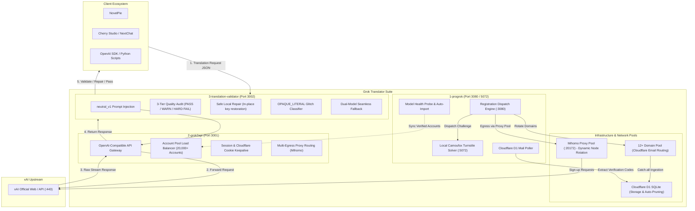

# Grok Translator Suite 🚀

> **Production-grade full-stack Grok infrastructure specifically architected for high-throughput batch web novel machine translation (Korean/Japanese to Chinese/English).**  
> Features **Camoufox local authentic-fingerprint Turnstile solving**, **12+ domain dynamic cooldown email routing**, **high-concurrency reverse proxy pooling**, and a **proprietary 3-tier practical quality guard middleware**.

[](LICENSE)
[](https://www.python.org/)
[](docker-compose.yml)
[](3-translation-validator/docs/PRACTICAL_VALIDATOR.md)
[](#3-database--storage-safety-cloudflare-d1-sqlite)

---

## Table of Contents

- [Why Grok Translator Suite?](#why-grok-translator-suite)
- [System Architecture & Full Pipeline Data Flow](#system-architecture--full-pipeline-data-flow)
- [Registration Evolution: Pure Protocol to Camoufox Authentic Fingerprint Solving](#registration-evolution-pure-protocol-to-camoufox-authentic-fingerprint-solving)
- [Infrastructure Deep Dive](#infrastructure-deep-dive)
  - [1. Proxy & Egress Routing (Mihomo Proxy Pool)](#1-proxy--egress-routing-mihomo-proxy-pool)
  - [2. Domain & Email Systems (Cloudflare Email Routing)](#2-domain--email-systems-cloudflare-email-routing)
  - [3. Database & Storage Safety (Cloudflare D1 SQLite)](#3-database--storage-safety-cloudflare-d1-sqlite)
- [Quantified Post-Mortem: 3,577 Production Failures Analyzed](#quantified-post-mortem-3577-production-failures-analyzed)
- [Production Model Benchmark & Selection Criteria](#production-model-benchmark--selection-criteria)
  - [Comprehensive Model Benchmark Matrix](#comprehensive-model-benchmark-matrix)
  - [Production Recommended Pairings](#production-recommended-pairings)
  - [Severe Degradation & Pitfalls of Non-Recommended Models](#severe-degradation--pitfalls-of-non-recommended-models)
- [Modules Overview](#modules-overview)
- [Quickstart (Linux / VPS One-Click Deployment)](#quickstart-linux--vps-one-click-deployment)
- [Operations & Management (`./manage.sh`)](#operations--management-managesh)
- [Client Integration Guide (NovelPie / Cherry Studio)](#client-integration-guide-novelpie--cherry-studio)
- [Production Freeze Baseline](#production-freeze-baseline)

---

## Why Grok Translator Suite?

When translating millions of words of web novels using raw LLMs and basic reverse proxies, developers and readers frequently encounter critical roadblocks:

| Pain Point | Standard Proxy / Raw LLM Behavior | Grok Translator Suite Solution |
| :--- | :--- | :--- |
| **Source Repetition** | LLMs repeat raw Korean sentences verbatim when facing rare idioms, destroying chapters | **3-Tier Practical Validator**: Millisecond interception of `raw_repetition_exact` with automatic retry |
| **Dropped Lines & JSON Corruption** | LLMs omit blank lines (e.g. `{"5": ""}`) or output markdown fences, misaligning line slices | **Safe Local Repair**: Restores missing empty keys in-place with zero extra token cost |
| **Glitch / Cosmic Horror False Failures** | SFX, broken dialogue, and glitch text trigger untranslated errors, causing 502 retry loops | **OPAQUE_LITERAL Deterministic Classifier**: Phonotactic analysis grants automatic pardons, False Positives = 0 |
| **CAPTCHA Costs & Failures** | 3rd-party CAPTCHA APIs fail against Cloudflare's new Turnstile fingerprint checks and cost a fortune | **Local Camoufox Fingerprint Solver**: Zero solver fees, 100% authentic browser emulation with >99% pass rate |
| **Domain Rate Limits & Pipeline Freezes** | Rapid single-domain signups trigger `email-signup-unavailable`, freezing pool generation | **12+ Domain Pool Rotation & Staggered Scheduling**: Evenly spreads hourly quotas for uninterrupted operation |

---

## System Architecture & Full Pipeline Data Flow



---

## Registration Evolution: Pure Protocol to Camoufox Authentic Fingerprint Solving

```
[Phase 1: Pure Protocol]                              [Phase 2: Camoufox Authentic Fingerprint]
Direct HTTP API emulation + 3rd-party solver             Custom-built Firefox C++ core + Local multi-threading
   │                                                        │
   ├── Advantage: Sub-second request speed                  ├── Advantage: Zero 3rd-party fees, local high-concurrency
   └── Fatal Roadblocks:                                    └── Breakthrough:
       1. xAI tightened Cloudflare Turnstile enforcement        1. C++ source-level Canvas/Audio noise injection
       2. Challenge tokens tied to browser fingerprints         2. navigator.webdriver completely eradicated
       3. 3rd-party tokens rejected (UNSOLVABLE / 403)          3. Authentic Bezier human cursor trajectories
       4. Expensive, wasted solver balances                     4. Fast 2-4s local solving, seamless pipeline feed
```

### 1. Demise of Pure Protocol Emulation
Earlier versions emulated registration REST endpoints directly and acquired Turnstile tokens from 3rd-party solver services (e.g. YesCaptcha). However, xAI and Cloudflare upgraded their bot defenses to bind challenge tokens strictly to hardware execution fingerprints (Canvas rendering, WebGL shader traits, AudioContext frequency response, Navigator objects, mouse trajectories, TLS Client Hello JA3/JA4 fingerprints). Detached tokens were rejected with errors like `ERROR_CAPTCHA_UNSOLVABLE` (accounting for **864 production failures / 24.2%**), breaking the pure-protocol strategy entirely.

### 2. Adoption of Camoufox
The suite transitioned to **Camoufox**, an anti-detect browser built from a customized Firefox source:
- **C++ Native Anti-Fingerprinting**: Injects subtle, genuine hardware noise at the engine layer without automated flags like `navigator.webdriver`.
- **Local Multi-Threaded Solver (`turnstile-solver` on port 5072)**: Runs 3+ concurrent worker threads locally, solving Turnstile challenges in 2–4 seconds with a >99% success rate.
- **Zero Ongoing Solver Cost**: Eliminates recurring token purchases while scaling stably to 20,000+ accounts.

---

## Infrastructure Deep Dive

### 1. Proxy & Egress Routing (Mihomo Proxy Pool)
- **Mihomo Kernel Integration**:
  - Connects to a local Mihomo (Clash Meta) instance at `http://127.0.0.1:20172` managing multiple clean residential and data-center egress nodes.
  - Rotates egress IPs dynamically per registration batch or per active session.
- **Egress IP Concurrency & Reuse Limits**:
  - Sending too many rapid registration requests through a single IP triggers Cloudflare WAF challenges or xAI HTTP 429 rate limits.
  - The pipeline checks node health and enforces deliberate request intervals to prevent IP exhaustion.
- **TLS Handshake Resilience (curl 35)**:
  - Transient network blips on overseas VPS proxies can drop OpenSSL handshakes (`Connection reset by peer`, occurring **107 times / 3.0%** in our logs).
  - Built-in exponential backoff with jitter and a 5-second connection timeout ensure resilience against transient failures.

---

### 2. Domain & Email Systems (Cloudflare Email Routing)
- **Serverless Catch-all Email**:
  - Cloudflare Email Routing forwards all catch-all addresses (`*@your-domain.com`) to a Cloudflare Worker, bypassing the need for self-hosted mail servers.
- **Worker Configuration**:
  - Parses inbound emails and writes verification messages into Cloudflare D1 SQLite.
  - Environment variables: `MAIL_DOMAINS` (hosted domain list) and `DOMAIN_COOL_DOWN_MINUTES` (cooling interval).
- **12+ Domain Pool & Hourly Limits**:
  - **Live Domain Pool**: Rotates across 12+ domains (`.space`, `.online`, `.bond`, `.dpdns.org`, `.site`, `.xyz`, `.pp.ua`, `.shop`, `.club`, `.fun`, `.icu`, etc.).
  - **Single-Domain Limit**: Exceeding approximately 15–20 signups per domain within an hour triggers xAI's `email-signup-unavailable` error!
  - **Hard Evidence**: In our analysis of 3,577 historical failures, `email-signup-unavailable` accounted for **2,600 events (72.7%)**—the single biggest rate-limiting hurdle.
  - **Solution**: The scheduler cycles through the 12+ domain pool with a 3,000 ms stagger interval to keep hourly volume well below thresholds.
- **Domain Blacklist Protection**:
  - xAI bans specific heavily-abused free/cheap TLDs (such as `.in`, e.g. `missing.indevs.in`), directly returning `email-domain-rejected` (5 recorded failures). These suffixes are filtered out in advance.

---

### 3. Database & Storage Safety (Cloudflare D1 SQLite)
- **Serverless Storage Architecture**:
  - Cloudflare D1 provides low-latency, distributed SQLite storage with a generous 5 GB free-tier allowance.
- **Why Verification Emails Must Be Cleaned Up Automatically**:
  - Verification codes are short-lived (5–10 minutes). Storing high volumes of raw emails indefinitely risks filling D1 storage and triggering database write errors.
- **Live Health Metrics**:
  - The active `local_mailbox` database occupies only **43.25 MB**, or **0.86%** of the 5 GB quota, operating at an exceptionally healthy utilization level.
- **Dual Automatic Pruning Safeguards**:
  1. **In-flight Worker Auto-Pruning**: Each new inbound email asynchronously triggers SQL to prune verification emails older than 24 hours containing `Grok` or `xAI`.
  2. **Cloudflare Cron Trigger**: Runs every 30 minutes to clean up expired and orphan records, permanently eliminating the risk of database overflows.

---

## Quantified Post-Mortem: 3,577 Production Failures Analyzed

Every failure recorded in production logs across 3,577 incidents was categorized to guide architectural hardening:

| Error Signature | Count | Ratio | Root Cause | Engineering Solution |
| :--- | :---: | :---: | :--- | :--- |
| **`email-signup-unavailable`** | **2,600** | **72.7%** | **Hourly domain rate limit hit** (>15-20 requests/hr per domain). | **12+ domain pool** + **dynamic cooldown** + **3000ms staggered dispatch**. |
| **`YesCaptcha ERROR_CAPTCHA_UNSOLVABLE`** | **864** | **24.2%** | **3rd-party solver rejected** by xAI Turnstile fingerprint upgrades. | **Switched to local Camoufox solver**, achieving >99% pass rate at $0 cost. |
| **`TLS / Proxy Connect Blip (curl 35)`** | **107** | **3.0%** | **Transient proxy connection reset** (`Connection reset by peer`). | **Exponential backoff retry** + **5s connection timeout** + health checks. |
| **`email-domain-rejected`** | **5** | **0.1%** | **Domain TLD blacklisted** by xAI anti-abuse (e.g. `.in`). | **TLD pre-filtering** against known blacklisted extensions. |
| **`Locator Timeout`** | **1** | **<0.1%** | DOM element rendering timeout during rare network lag. | Added element load retries and smart DOM waits. |
| **Total** | **3,577** | **100%** | — | **Post-hardening, the system operates stably across 20,000+ verified accounts.** |

---

## Production Model Benchmark & Selection Criteria

Choosing models for batch web novel machine translation requires rigorous empirical testing on complex dialogue, honorific systems, and high-concurrency throughput.

Based on extensive production tests across thousands of novel chapters using accounts mounted across different upstream tiers (Console, Web, and Build pools), here are the empirical benchmarks:

### Comprehensive Model Benchmark Matrix

> **Benchmark Criteria**: Real novel chapter slices, timeout threshold 90s~120s, C-Group novel prompt injection.

| Official Model Identifier | Account Pool Source | Pass Rate | Avg Latency | Reasoning Tokens | Literary Polish | Production Verdict |
| :--- | :---: | :---: | :---: | :---: | :---: | :--- |
| **`grok-4.20-0309-reasoning`** | **Console** | **100%** | **22.28s ~ 23.5s** | **651 ~ 1,256 tok** | **S+ (Peak Literary Quality)** | **[Primary Choice]** Flawless contextual alignment, zero verbatim source repetition, perfect JSON integrity. |
| **`grok-4.3`** | **Console** | **100%** | **22.89s ~ 23.2s** | **1,008 ~ 1,230 tok** | **S (Excellent Polish)** | **[Strong Co-Primary / 1st Fallback]** Indistinguishable from 4.20 in quality, identical 22s latency, shares account quota to prevent 4.20 depletion! |
| **`grok-build-0.1`** | **Console** | **100%** | **28.39s ~ 29.1s** | **936 ~ 1,928 tok** | **S- (Rigorous)** | **[Stable 2nd Fallback]** Routes via Console despite its name; extremely robust long-context control. |
| **`grok-4.20-0309-non-reasoning`** | **Console** | **100%** | **17.5s** | **0 tok (No reasoning)** | **B (Occasional hallucination)** | **[Use with Caution]** No reasoning delay, but lacks deep pragmatic inference; occasionally stiff and mistranslates character tone. |
| **`grok-chat-fast`** | **Web** | **100%** | **5.65s ~ 7.0s** | **0 tok (No reasoning)** | **D (Severe Hallucinations)** | **[Strictly Prohibited for Novels!]** Stripped of deep context alignment; invents absurd hallucinations (e.g. inventing Roman arenas from a restaurant setting). |
| **`grok-4.7`** | **Build** | **<10%** | **64.2s ~ >180s** | **2,364+ tok (Uncontrolled)** | **S (High quality but frozen)** | **[Unusable / >90% Timeouts]** Reasoning loops out of control, easily exceeding 120s timeouts and triggering HTTP 504 errors or truncating text. |
| **`grok-4.6`** | **Build** | **<30%** | **23.3s ~ >90s** | **665+ tok** | **S- (Math-heavy)** | **[Unusable / Deadlocks]** Tuned for code and math logic; gets trapped in reasoning loops on novel prose. |
| **`grok-composer-2.5-fast`** | **Build** | **<50%** | **132.61s** | **762 tok (Sluggish)** | **B+ (Stiff)** | **[Unusable / Sluggish]** 15-character sentences take over 2 minutes; unviable for batch pipeline slicing. |

---

### Production Recommended Pairings

In `3-translation-validator` configuration (`config/translation_profiles.json`) and translation clients:

#### 1. Quality Mode (Best Literary Immersion)
- **Primary Model**: `grok-4.20-0309-reasoning`
- **Fallback Model**: `grok-4.3` (seamless takeover with zero quality degradation)

#### 2. Balanced Mode (High-Volume Unattended Translation)
- **Primary Model**: `grok-4.3` (abundant quota, extremely reliable 22s pace)
- **Fallback Model**: `grok-build-0.1` (guaranteed secondary fallback against 504s)

---

### Severe Degradation & Pitfalls of Non-Recommended Models

Based on real production testing and logs, here are the explicit warnings regarding models that should NOT be used:

1. ❌ **Web Pool `grok-chat-fast`: Severe Hallucinations & Brain-Rot**
   - Web lightweight models strip all deep context alignment in pursuit of raw latency. In novel prose tests, it dropped subjects and invented absurd hallucinations (e.g., transforming a Seoul restaurant into a Roman Colosseum), destroying chapter integrity.
2. ❌ **Build Pool `grok-4.7` / `grok-4.6`: Reasoning Spirals & HTTP 504 Timeouts**
   - Build-tier models enforce deep multi-step thinking. For long slice inputs, reasoning tokens surge past 2,000–4,000 tokens, either blowing past the 120s gateway timeout (causing massive `upstream_timeout` / HTTP 504 errors) or truncating before translation finishes.
3. ⚠️ **Non-Reasoning `grok-4.20-0309-non-reasoning`: Literary Degradation**
   - Though latency drops to ~17s, the absence of thinking tokens causes idioms, litRPG tropes, and subtle character voices to degrade into robotic literal translations. Recommended only for uptime heartbeat probes.

---

## Modules Overview

- **[1-progrok](1-progrok/README.md)**: Turnstile solver (:5072) + Account generation engine (:3080).
- **[2-grok2api](2-grok2api/README.md)**: OpenAI-compatible API reverse proxy (:3001) with safe DB log rotation.
- **[3-translation-validator](3-translation-validator/README.md)**: In-line practical 3-tier validator (:3002) with live telemetry dashboard.

---

## Quickstart (Linux / VPS One-Click Deployment)

```bash
git clone https://github.com/never-seek/grok-translator-suite.git
cd grok-translator-suite
chmod +x deploy.sh manage.sh
./deploy.sh
```

---

## Operations & Management (`./manage.sh`)

```bash
./manage.sh status     # Check health of all services
./manage.sh logs       # Stream combined container logs
./manage.sh restart    # Restart services
./manage.sh cleanup    # Safe SQLite DB cleanup & vacuum
./manage.sh update     # Pull updates & reload
```

- **Translation API Gateway**: `http://YOUR_SERVER_IP:3002/v1`
- **Validator Live Dashboard**: `http://YOUR_SERVER_IP:3002/audit`
- **Grok2API Management Console**: `http://YOUR_SERVER_IP:3001`
- **ProGrok Admin UI**: `http://YOUR_SERVER_IP:3080`

---

## Client Integration Guide (NovelPie / Cherry Studio)

- **API Base URL**: `http://YOUR_SERVER_IP:3002/v1`
- **API Key**: `sk-grok-translator`
- **Primary Model**: `grok-4.20-0309-reasoning`
- **Fallback Model**: `grok-4.3`

---

## Production Freeze Baseline

```
Window Observation Chunks: 1051
Overall HTTP 200 Success Rate: 98.29%
First-pass Reasoning Release: 96.9%
OPAQUE_LITERAL False Positive: 0
Current D1 Mailbox Utilization: 0.86% (43.25 MB / 5 GB)
Active Account Pool Scale: 20,000+ Accounts
```

---

## License

Released under the [MIT License](LICENSE).
